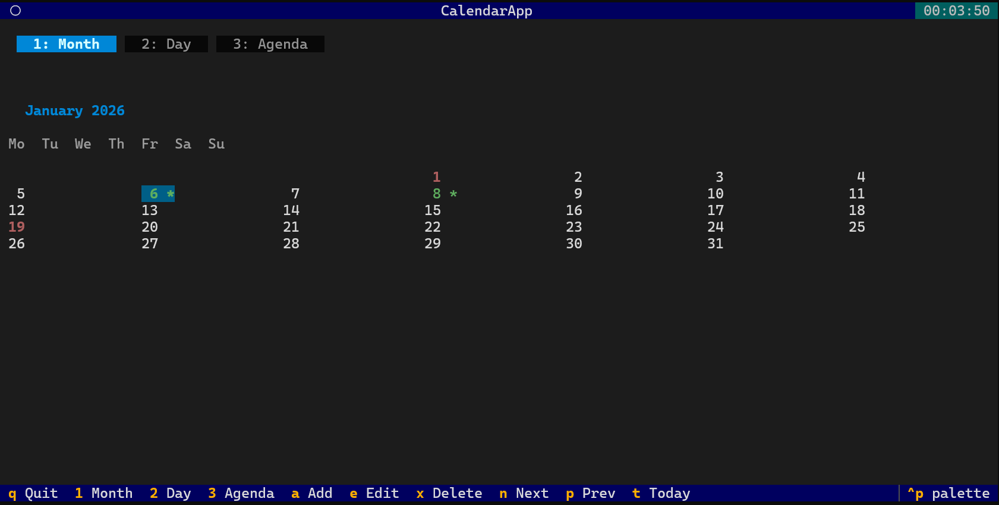

# cal

A beautiful terminal calendar for your daily life.




## What it does

- Browse months with arrow keys, jump to any date
- Create, edit, and delete events
- See holidays for your country
- Get a fun "On This Day" historical fact each time you open it

## Quick start

```bash
git clone https://github.com/rtvkiz/cal.git
cd cal
python -m venv venv
source venv/bin/activate
pip install -e .
```

Then just run:

```bash
cal
```

### Make it available everywhere

To use `cal` from any directory:

```bash
mkdir -p ~/.local/bin
ln -sf $(pwd)/venv/bin/cal ~/.local/bin/cal
```

Make sure `~/.local/bin` is in your PATH (add to your `.bashrc` or `.zshrc`):

```bash
export PATH="$HOME/.local/bin:$PATH"
```

## Keyboard shortcuts

| Key | What it does |
|-----|--------------|
| Arrow keys | Move around the calendar |
| Enter | Open the selected day |
| Escape | Go back |
| `a` | Add a new event |
| `e` | Edit an event |
| `x` | Delete an event |
| `n` / `p` | Next / Previous month |
| `t` | Jump to today |
| `1` `2` `3` | Switch views (Month, Day, Agenda) |
| `q` | Quit |

## Adding events

1. Press `a`
2. Type a title
3. Set the date (YYYY-MM-DD)
4. Optionally add a time (HH:MM) and description
5. Save

Your events are stored in `~/.cal/events.json`.

## Holidays

The calendar shows holidays based on your country. Edit `~/.cal/config.json` to change it:

```json
{
  "country": "US",
  "subdivision": null,
  "show_holidays": true
}
```

Use any two-letter country code (US, GB, DE, IN, etc.). Set `subdivision` for state-specific holidays.

## Requirements

- Python 3.10+

## License

MIT
